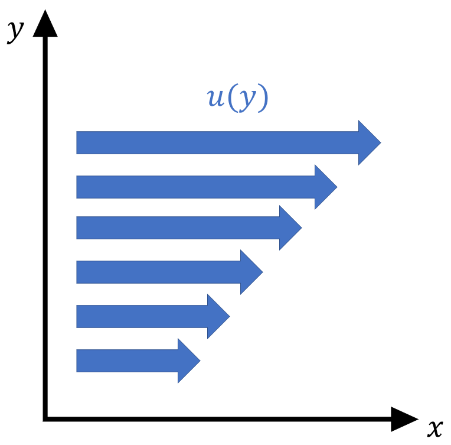

# Q1.1
> Pour différents type de fluide, expliquer la relation liant les contraintes de cisaillement et le gradient de vitesse. Détailler particulièrement les deux fluides suivants : fluide newtonien et fluide parfait

- Si on applique une force sur un liquide, celui ci s'écoule dans la même direction.

- L'écoulement peut se modéliser par un champ de vecteur parallèle à la force appliqué

- Si on prend en considération deux points dans le fluide :
	$$\theta = \frac{d}{h} = \frac{U_2 \Delta t - U_1 \Delta t}{y_2 - y_1}$$
	$$\frac{\theta}{\Delta t}=\frac{U_2 - U_1}{y_2 - y_1} = \frac{\partial u}{\partial y}$$

- Plus la force de cisaillement est grand, plus la déformation est rapide $\rightarrow$ plus les vitesse sont élevé.