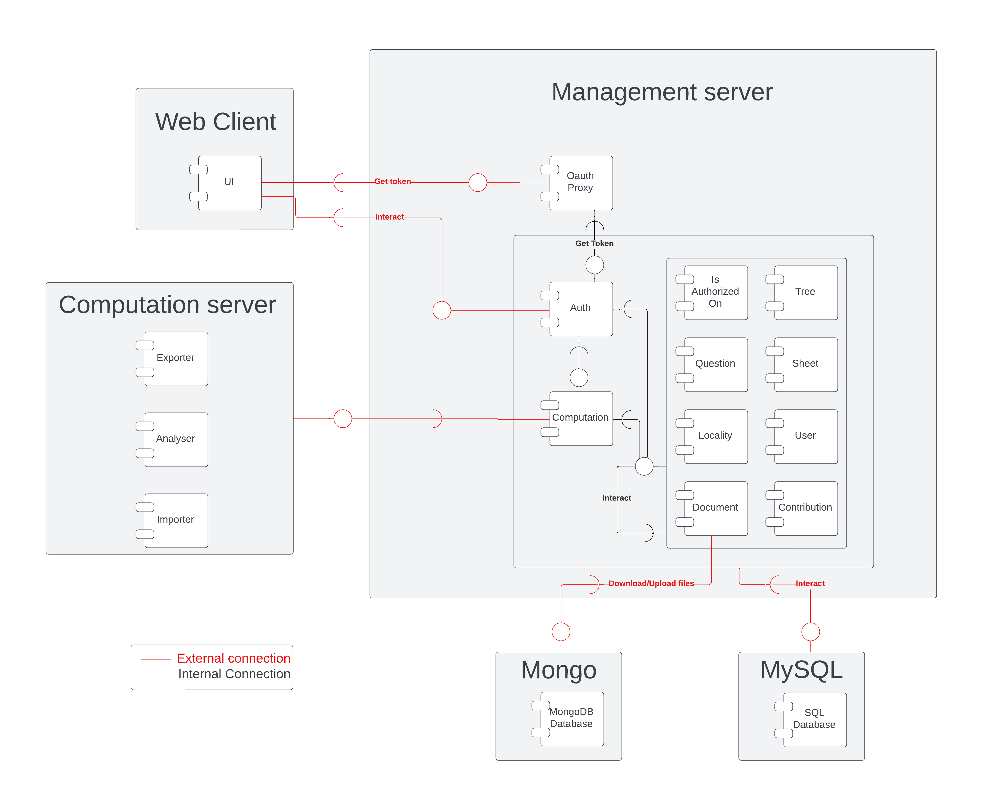

# Explication des composants de Lingwal

## Préface

Ces explications sont basées uniquement sur mon expérience avec le projet intégré Lingwal. Je ne prétends pas être un expert en composants. Cette approche a très bien fonctionné pour nous, mais elle ne convient peut-être pas à tous les projets.

Le texte a été rédigé par moi, puis corrigé grammaticalement avec l'aide de ChatGPT.

### Qu'est-ce qu'un composant ?  
Un composant est une boîte noire qui propose des interfaces et utilise celles d'autres composants. En tant que boîte noire, il n'expose que ses fonctionnalités via des interfaces bien définies, tandis que son fonctionnement interne est caché et isolé du reste du système. Cela permet aux composants d'être indépendants, n'interagissant entre eux qu'à travers ces interfaces. Un composant est donc défini uniquement par ce qu'il fait, et non par la manière dont il le fait. Cette abstraction permet de changer l'implémentation d'un composant sans affecter le reste du système, tant que les interfaces restent intactes.

### Quel est l'intérêt des composants ?  
Puisque les composants sont des boîtes noires définies par leurs interfaces, il suffit de spécifier ces interfaces, et leur implémentation est indépendante. Par exemple, si un composant nécessite des modifications ou des améliorations, cela peut être fait sans impacter les autres composants du système. Ce découplage permet également à plusieurs équipes de travailler en parallèle, chacune sur des composants distincts, sans avoir besoin de connaître les détails des autres parties du système. Cela allège considérablement la collaboration en équipe, réduit les risques de conflits lors de l'intégration et favorise l'indépendance des développeurs.

Prenons l'exemple de l'ajout d'une nouvelle fonctionnalité dans mon projet : si nous avons besoin d'un nouveau type de donnée ou d'une nouvelle manipulation, il suffit de créer un nouveau composant qui implémente cette fonctionnalité, sans toucher aux composants existants. Cela rend le système très évolutif et permet d’ajouter ou de retirer des fonctionnalités rapidement.

En outre, comme les interfaces sont définies à l'avance, le code est bien structuré, ce qui simplifie la production. C'est étonnant de voir à quel point on peut accomplir des tâches complexes de manière simple lorsque l'on est bien organisé.

## Les composants de Lingwal

### Explication des composants

Dans un diagramme UML, les composants sont représentés par des rectangles. Les cercles pleins représentent les interfaces définies, et les demi-cercles représentent les interfaces nécessaires. Par exemple, le composant **OAuth Proxy** implémente une interface qui permet de récupérer un token et utilise l'interface d'**Auth** pour obtenir ce token.

Avant de commencer, on peut identifier cinq catégories : **Web Client**, **Computation Server**, **Management Server**, **MongoDB**, et **MySQL**. Elles indiquent dans quel pod les composants sont implémentés, mais pour l'instant, nous pouvons faire abstraction de cela.

Dans mon UML, il y a plusieurs types de composants : la data, les manipulateurs de données, les gestionnaires, et les utilisateurs.

#### La data et les manipulateurs de données  
Il y a deux composants qui stockent des données : **MongoDB Database** et **SQL Database**. Le premier est utilisé pour stocker des fichiers, et le second pour les autres types de données.

Huit composants manipulent les données : **Is Authorized On**, **Tree**, **Question**, **Sheet**, **Locality**, **User**, **Document**, et **Contribution**. Chaque composant correspond à un type de donnée stocké dans la base de données. On peut les identifier en consultant le modèle ER des bases de données.

L'élément clé est que seuls les manipulateurs de données peuvent interagir avec les bases de données. Comme les données sont fragiles et peuvent être facilement corrompues, il est crucial que leur manipulation soit contrôlée avec rigueur. Chaque manipulateur de données ne peut manipuler que les données qui lui sont attribuées. Par exemple, le manipulateur de **User** ne peut traiter que les utilisateurs. Si ce dernier doit interagir avec les contributions, il demandera au manipulateur de **Contribution**, mais ne le fera pas lui-même. Cela garantit que tant que chaque manipulateur fait correctement son travail, les données sont robustes et non corrompues. Si cette approche est bien mise en place, il est pratiquement impossible d'avoir des problèmes de corruption de données. 

Un autre avantage est la gestion de la sécurité. Chaque manipulation de données étant contrôlée par un composant dédié, il est beaucoup plus facile de gérer les autorisations d'accès aux données. Par exemple, si une nouvelle règle de sécurité est mise en place, elle peut être appliquée directement au niveau du composant concerné, sans avoir à toucher aux autres parties du système. Cela simplifie également l'audit et le suivi des interactions.

De plus, la modularité rend le code plus simple et plus évolutif. Si un nouveau type de donnée est nécessaire, il suffit de créer un nouveau composant dédié, et le reste du système continue de fonctionner sans interruption.

#### Les gestionnaires (managers)  
Les gestionnaires sont : **OAuth Proxy**, **Auth**, et **Computation**. Ils gèrent les aspects qui ne sont pas directement liés à l'application mais qui sont indispensables à son bon fonctionnement.

- **OAuth Proxy** redirige l'utilisateur vers le SSO de l'ULiège et donne un cookie pour identifier le client et l'utilisateur. Il établit également une connexion chiffrée entre le client et le serveur.
- **Auth** associe le client et l'utilisateur, puis vérifie que l'utilisateur est légitime avant de rediriger la requête vers la destination souhaitée.
- **Computation** lance des processus de calculs et renvoie les résultats.

Ces gestionnaires sont invisibles pour l'utilisateur final, qui ne leur envoie jamais de requêtes directement. Ils fonctionnent comme la poste : ils prennent la requête, la manipulent et la transmettent au destinataire. Cela permet de simplifier les interactions du point de vue de l'utilisateur tout en traitant des aspects complexes en arrière-plan, comme la gestion des droits d'accès et l'optimisation des calculs.

#### Les utilisateurs  
Les utilisateurs sont : **UI**, **Exporter**, **Analyzer**, et **Importer**. Ils utilisent l'application et ont tous le même niveau d'accès. Ils sont généralement plus complexe et peuvent etre séparé en sous composants.

- **UI** représente l'interface utilisateur (le front-end du site).
- **Exporter**, **Analyzer**, et **Importer** sont des composants back-end. Ils réalisent des calculs sur demande. Ils ont les même pouvoirs que l'UI, mais peuvent retourner une réponse à **Computation**.

L'une des forces de cette approche est que chaque utilisateur utilise les mêmes interfaces pour interagir avec le système, qu'il s'agisse du front-end ou des processus back-end. Cela garantit que tous les utilisateurs, y compris les systèmes automatisés, respectent les mêmes règles et les mêmes contraintes, renforçant ainsi la cohérence et la sécurité globale.

### Explication des 5 pods

Il y a 5 pods :

1. **Web Client** : fournit l'UI au client et n'a accès qu'au **Management Server**.
2. **Computation Server** : exécute tous les calculs nécessitant beaucoup de ressources et n'a accès qu'au **Management Server**.
3. **MongoDB** : héberge la base de données MongoDB. Seul le **Management Server** y a accès.
4. **MySQL** : héberge la base de données MySQL. Seul le **Management Server** y a accès.
5. **Management Server** : s'occupe de la manipulation des données et garantit leur intégrité et leur sécurité. Tous les autres pods y ont accès, mais doivent être authentifiés. C'est le seul pod accessible au public (avec **Web Client**).

L'intérêt d'avoir plusieurs pods est multiple. Premièrement, cela améliore la sécurité : chaque pod n'a accès qu'aux ressources dont il a besoin, en suivant le principe du privilège minimum. Cela limite les risques d’erreurs humaines ou d’attaques. Deuxièmement, cela permet de répartir le travail sur plusieurs machines, optimisant ainsi la performance du système. Enfin, si un pod plante, il n'est nécessaire de redémarrer qu'une seule partie du système, minimisant l'impact sur les utilisateurs. Il y a d'autre intérêtes.

### Collaboration et organisation d’équipe

L'un des principaux avantages de cette architecture est son impact sur le travail en équipe. Chaque équipe peut se concentrer sur un composant ou un ensemble de composants spécifiques, sans interférer avec le travail des autres. Cela réduit le risque de conflits de fusion (merge conflicts) lors de l'intégration et permet un développement parallèle plus fluide. En définissant des interfaces claires, chaque équipe sait exactement ce qui est attendu de son composant et peut se coordonner plus facilement avec les autres équipes.

### Conclusion  
Les composants n'ont pas besoin d'être parfaits, l'un des grands avantages de leur utilisation est leur modularité. Si un composant devient inutile, on peut le supprimer. S'il manque une fonctionnalité, on peut l'ajouter. Si un composant ne fonctionne pas, on peut le réparer. Cette modularité permet également de tester facilement chaque composant individuellement. Comme les interfaces sont définies à l'avance, il suffit de les utiliser et de vérifier si le résultat est celui attendu. 
